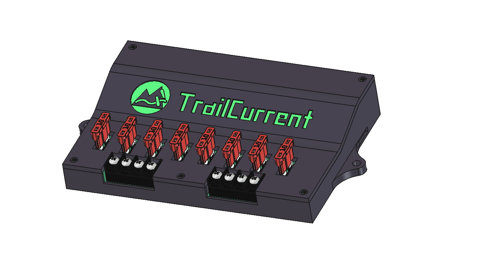

# TrailCurrent Torrent

<p align="center">
  
</p>

CAN-controlled 8-channel PWM power distribution module for vehicle lighting and accessory control with OTA firmware update capability and mDNS self-discovery. Up to 3 Torrent modules can operate on the same CAN bus, each with a unique address and CAN IDs. Part of the [TrailCurrent](https://trailcurrent.com) open-source vehicle platform.

## Hardware Overview

- **Microcontroller:** ESP32 (WROOM32)
- **Function:** 8-channel PWM lighting/accessory controller with CAN bus interface
- **Key Features:**
  - 8 independent MOSFET-driven PWM outputs (0-255 brightness)
  - CAN bus communication at 500 kbps
  - Up to 3 modules on the same bus via compile-time `TORRENT_ADDRESS` (0-2)
  - Individual and master on/off/brightness control
  - Animated light sequences (startup, interior, exterior)
  - Over-the-air (OTA) firmware updates via WiFi
  - mDNS self-discovery for automatic registration with Headwaters
  - WiFi credentials provisioned dynamically over CAN bus
  - Hierarchical PCB schematic design (5 sheets)

## Hardware Requirements

### Components

- **Microcontroller:** ESP32 development board
- **CAN Transceiver:** Vehicle CAN bus interface (TX: GPIO 15, RX: GPIO 13)
- **MOSFET Drivers:** 8 channels for PWM output switching
- **DIP Switches:** Configuration switches

### Pin Connections

**PWM Outputs:**

| GPIO | Function |
|------|----------|
| 32 | Output 1 |
| 33 | Output 2 |
| 26 | Output 3 |
| 14 | Output 4 |
| 4 | Output 5 |
| 17 | Output 6 |
| 19 | Output 7 |
| 23 | Output 8 |

### KiCAD Library Dependencies

This project uses the consolidated [TrailCurrentKiCADLibraries](https://github.com/trailcurrentoss/TrailCurrentKiCADLibraries).

**Setup:**

```bash
# Clone the library
git clone git@github.com:trailcurrentoss/TrailCurrentKiCADLibraries.git

# Set environment variables (add to ~/.bashrc or ~/.zshrc)
export TRAILCURRENT_SYMBOL_DIR="/path/to/TrailCurrentKiCADLibraries/symbols"
export TRAILCURRENT_FOOTPRINT_DIR="/path/to/TrailCurrentKiCADLibraries/footprints"
export TRAILCURRENT_3DMODEL_DIR="/path/to/TrailCurrentKiCADLibraries/3d_models"
```

See [KICAD_ENVIRONMENT_SETUP.md](https://github.com/trailcurrentoss/TrailCurrentKiCADLibraries/blob/main/docs/KICAD_ENVIRONMENT_SETUP.md) in the library repository for detailed setup instructions.

## Opening the Project

1. **Set up environment variables** (see Library Dependencies above)
2. **Open KiCAD:**
   ```bash
   kicad EDA/trailcurrent-torrent.kicad_pro
   ```
3. **Verify libraries load** - All symbol and footprint libraries should resolve without errors
4. **View 3D models** - Open PCB and press `Alt+3` to view the 3D visualization

### Schematic Sheets

The design uses a hierarchical schematic with dedicated sheets:
- **Root** - Top-level connections
- **Power** - Power distribution and regulation
- **CAN** - CAN bus transceiver interface
- **MCU** - ESP32 microcontroller and support circuits
- **MOSFETs** - 8-channel MOSFET driver outputs
- **DIP Switch** - Configuration switches

## Firmware

Built with [ESP-IDF](https://docs.espressif.com/projects/esp-idf/en/latest/esp32/) (Espressif IoT Development Framework) targeting the ESP32.

### Prerequisites

Install ESP-IDF v5.x following the [official guide](https://docs.espressif.com/projects/esp-idf/en/latest/esp32/get-started/).

### Build and Flash

```bash
# Set up ESP-IDF environment
source ~/esp/v5.5.2/esp-idf/export.sh

# First time: set chip target
idf.py set-target esp32

# Build firmware (default address 0)
idf.py build

# Build for a specific module address (0-2)
idf.py build -DTORRENT_ADDRESS=1

# Flash and monitor (serial)
idf.py -p /dev/ttyUSB0 flash monitor
```

### Multi-Instance Addressing

Up to 3 Torrent modules can share the same CAN bus. Each module is built with a unique address that determines its CAN IDs:

```bash
idf.py build                      # Address 0 (default)
idf.py build -DTORRENT_ADDRESS=1  # Address 1
idf.py build -DTORRENT_ADDRESS=2  # Address 2
```

Each address produces a firmware binary with unique CAN IDs (see CAN Bus Protocol below). Flash each binary to a different ESP32. At boot, the module logs its address and CAN IDs for verification.

### OTA Firmware Update

After initial serial flash, firmware can be updated over WiFi:

1. **Provision WiFi credentials** via CAN bus (message ID 0x01)
2. **Trigger OTA mode** via CAN bus (message ID 0x00 with device MAC bytes)
3. **Upload firmware** via HTTP:
   ```bash
   curl -X POST http://esp32-XXYYZZ.local/ota --data-binary @build/torrent.bin
   ```

The device enters OTA mode for 3 minutes, starts an HTTP server, and advertises via mDNS. After a successful upload it reboots into the new firmware. Dual OTA partitions provide rollback safety.

### mDNS Self-Discovery

Modules register themselves with the Headwaters controller:

1. **Provision WiFi credentials** via CAN bus (message ID 0x01)
2. **Send discovery trigger** via CAN bus (message ID 0x02, broadcast)
3. Module joins WiFi and advertises a `_trailcurrent._tcp` mDNS service with metadata:
   - `type=torrent` — module type
   - `addr=0` — module address (0-2, from `TORRENT_ADDRESS` build flag)
   - `canid=0x1B` — CAN status message ID (varies by address)
   - `fw=1.0.0` — firmware version
4. Headwaters confirms registration by calling `GET /discovery/confirm`
5. Module tears down WiFi and returns to normal CAN operation

Discovery can be triggered again on subsequent CAN 0x02 broadcasts. A module that is already running a discovery session ignores additional triggers until the current session completes or times out (3 minutes).

### Logging

Firmware uses the ESP-IDF logging system (`ESP_LOGI`, `ESP_LOGW`, `ESP_LOGE`). Log output is available on the serial monitor at 115200 baud.

Log verbosity can be configured at build time via `idf.py menuconfig` under **Component config > Log output**.

**WiFi Credentials:**
- WiFi credentials are provisioned dynamically via CAN bus (Message ID 0x01)
- Credentials are stored in NVS (non-volatile storage) and persist across reboots
- For standalone testing, credentials can be set manually via NVS

### CAN Bus Protocol

CAN IDs are computed as `BASE + TORRENT_ADDRESS`. The table below shows base IDs and per-instance values.

**Receive (Bus → Module):**

| Base ID | Addr 0 | Addr 1 | Addr 2 | Description |
|---------|--------|--------|--------|-------------|
| — | 0x00 | 0x00 | 0x00 | OTA update trigger (3 bytes: last 3 MAC bytes for device targeting) |
| — | 0x01 | 0x01 | 0x01 | WiFi credential provisioning (chunked SSID/password protocol) |
| — | 0x02 | 0x02 | 0x02 | Discovery trigger (broadcast, no payload) |
| 0x15 | 0x15 | 0x16 | 0x17 | Set brightness (byte 0 = channel 0-7, byte 1 = PWM value 0-255) |
| 0x18 | 0x18 | 0x19 | 0x1A | Toggle channel on/off (byte 0 = channel 0-7, 8=all off/on, 9=all on) |
| 0x33 | 0x33 | 0x34 | 0x35 | Trigger light sequence (byte 0: 0=interior, 1=exterior) |

**Transmit (Module → Bus):**

| Base ID | Addr 0 | Addr 1 | Addr 2 | Interval | Description |
|---------|--------|--------|--------|----------|-------------|
| 0x1B | 0x1B | 0x1C | 0x1D | 33 ms (30 Hz) | Status report — current PWM values for all 8 channels (8 bytes) |

### WiFi Credential Provisioning Protocol

WiFi credentials are sent over CAN in chunks (max 6 payload bytes per CAN frame):

| Step | data[0] | Payload | Description |
|------|---------|---------|-------------|
| 1 | 0x01 | ssid_len, pass_len, ssid_chunks, pass_chunks | Start message |
| 2 | 0x02 | chunk_index, up to 6 bytes | SSID chunk |
| 3 | 0x03 | chunk_index, up to 6 bytes | Password chunk |
| 4 | 0x04 | XOR checksum | End/commit message |

All messages are sent on CAN ID 0x01. A 5-second timeout resets the state machine if the sequence is interrupted.

## Manufacturing

- **PCB Files:** Ready for fabrication via standard PCB services (JLCPCB, OSH Park, etc.)
- **BOM Generation:** Export BOM from KiCAD schematic (Tools > Generate BOM)
- **JLCPCB Assembly:** See [BOM_ASSEMBLY_WORKFLOW.md](https://github.com/trailcurrentoss/TrailCurrentKiCADLibraries/blob/main/tools/BOM_ASSEMBLY_WORKFLOW.md) for detailed assembly workflow

## Project Structure

```
├── EDA/                          # KiCAD hardware design files
│   ├── trailcurrent-torrent.kicad_pro
│   ├── trailcurrent-torrent.kicad_sch  # Root schematic
│   ├── can.kicad_sch             # CAN subsystem
│   ├── mcu.kicad_sch             # MCU subsystem
│   ├── power.kicad_sch           # Power subsystem
│   ├── mosfets.kicad_sch         # 8-channel MOSFET drivers
│   ├── dip_switch.kicad_sch      # Configuration switches
│   └── trailcurrent-torrent.kicad_pcb  # PCB layout
├── CAD/                          # FreeCAD case design and 3D models
│   ├── trailcurrent-torrent-case.FCStd
│   └── TrailCurrentTorrent.3mf
├── main/                         # ESP-IDF firmware source
│   ├── main.c                    # App entry, LEDC PWM, TWAI CAN task, light sequences
│   ├── ota.h / ota.c             # OTA updates, WiFi management, credential provisioning
│   ├── discovery.h / discovery.c # mDNS self-discovery and Headwaters registration
│   ├── CMakeLists.txt            # Component build config
│   └── idf_component.yml         # ESP-IDF component dependencies
├── partitions.csv                # ESP32 flash partition layout (dual OTA)
├── sdkconfig.defaults            # ESP-IDF build defaults
└── CMakeLists.txt                # Root ESP-IDF project config
```

## License

MIT License - See LICENSE file for details.

This is open source hardware. You are free to use, modify, and distribute these designs under the terms of the MIT license.

## Contributing

Improvements and contributions are welcome! Please submit issues or pull requests.

## Support

For questions about:
- **KiCAD setup:** See [KICAD_ENVIRONMENT_SETUP.md](https://github.com/trailcurrentoss/TrailCurrentKiCADLibraries/blob/main/docs/KICAD_ENVIRONMENT_SETUP.md)
- **Assembly workflow:** See [BOM_ASSEMBLY_WORKFLOW.md](https://github.com/trailcurrentoss/TrailCurrentKiCADLibraries/blob/main/tools/BOM_ASSEMBLY_WORKFLOW.md)
